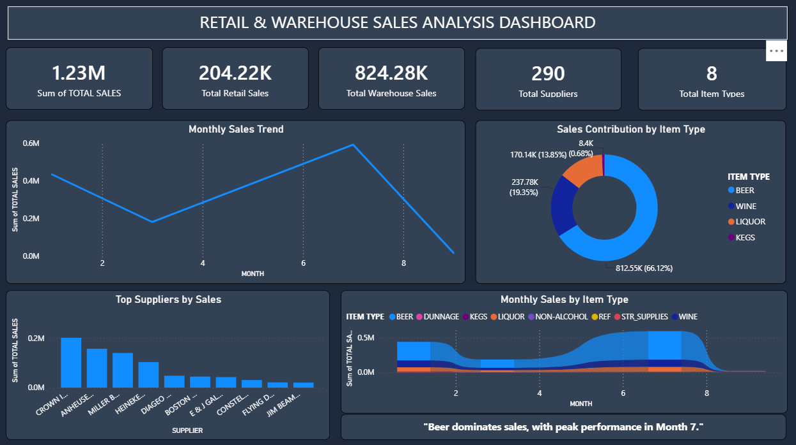

# Retail Sales Analytics Dashboard

## Project Overview

This project analyzes retail sales performance, seasonal trends, and marketing effectiveness using Power BI.

## Tools Used

- Power BI
- Power Query
- DAX
- Excel

## Key Objectives

- Analyze sales performance
- Identify seasonal trends
- Evaluate marketing impact
- Generate business insights

## Dashboard Preview

## Author

Shubham Khude

Aspiring Data Analyst
